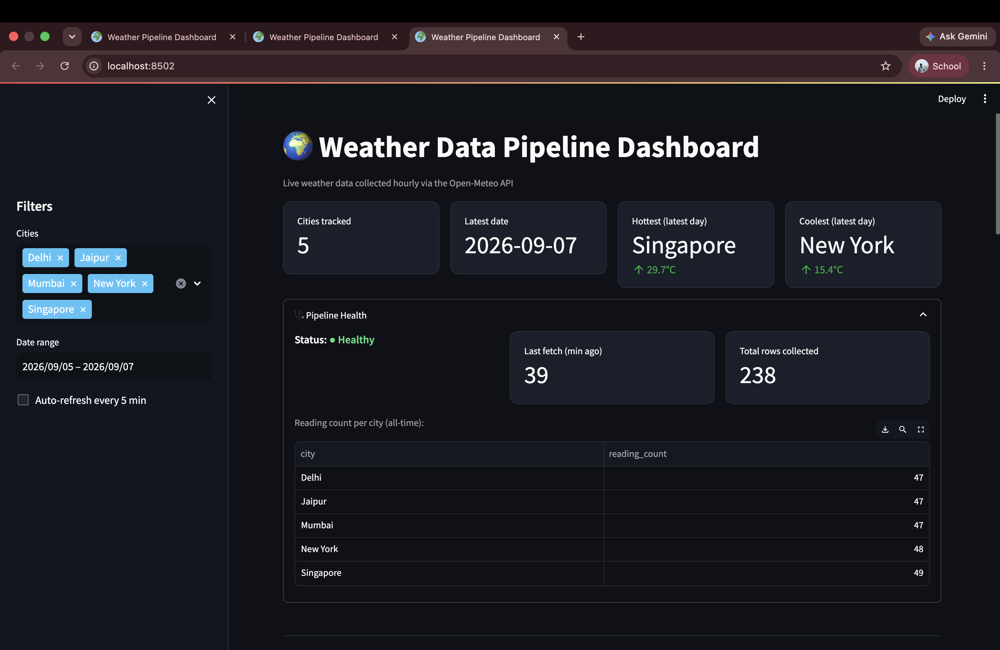

# 🌍 Weather Data Pipeline & Dashboard

A live, self-hosted data pipeline that collects hourly weather data 
for five global cities, transforms it into analytical tables, and 
surfaces it through an interactive dashboard — including a pipeline 
health panel that reflects the actual state of the ingestion process, 
not just the data.

## Live Demo
[Add Streamlit Cloud link here once deployed]

## The Question This Answers
Which cities have the most stable vs. volatile weather, and how does 
that vary day to day? This kind of question matters for anyone 
planning outdoor events, logistics, or comparing climates across 
locations — the answer isn't obvious from a single day's forecast, 
it requires accumulated historical data.

## Key Findings
*(from 7 days / 238 rows of collected data as of 11 September)*

- **New York** showed the widest average daily temperature swing 
  (5.4°C), making it the least thermally stable of the five cities 
  tracked — consistent with [inland/desert/etc.] climate patterns.
- **Mumbai** was the most stable, with an average daily range of 
  only 1.9°C.
- Humidity patterns diverged sharply by region: the Indian cities 
  (Delhi, Jaipur, Mumbai) trended toward 85%+ overnight humidity, 
  while New York's humidity swung more with time of day than with 
  season.

## Architecture